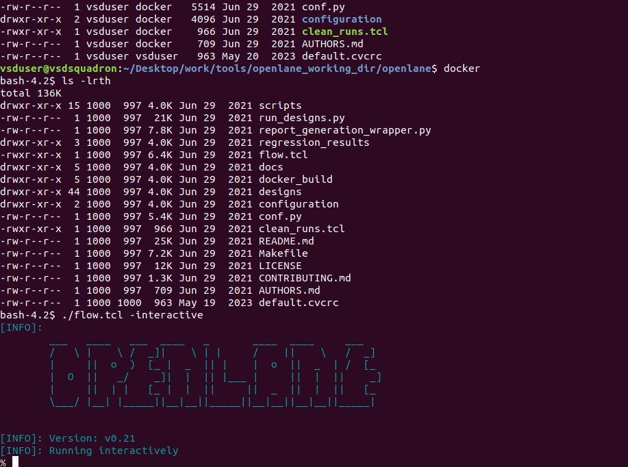
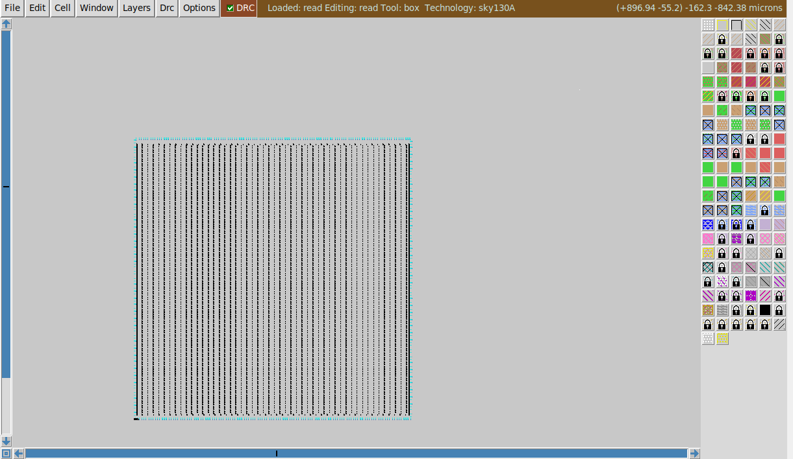
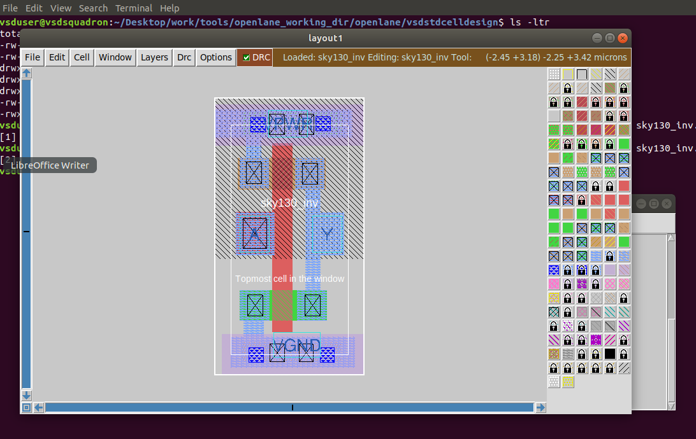
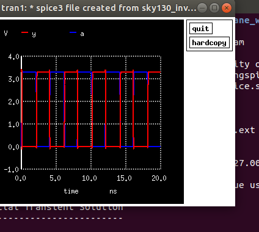
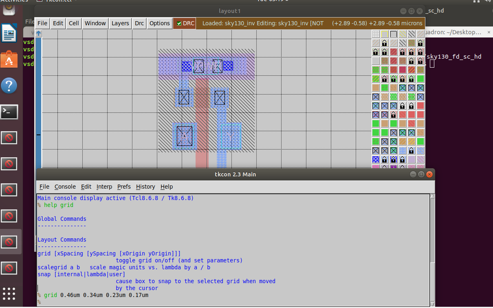
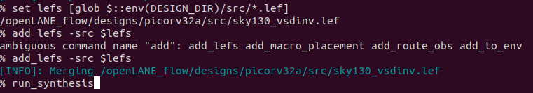
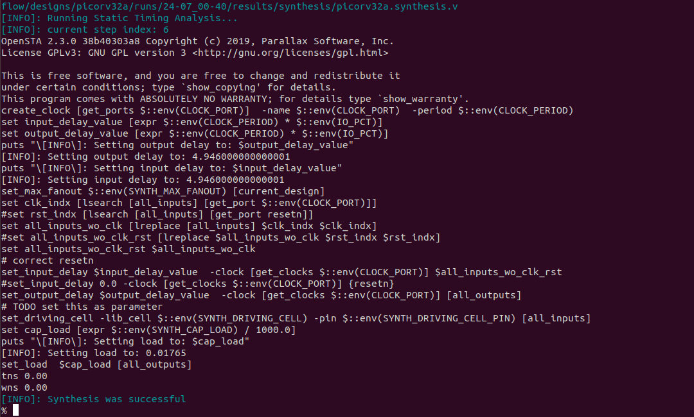
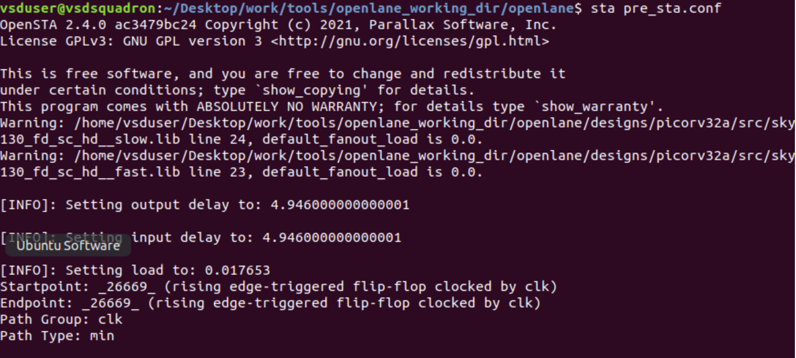

# Sky130 RTL-to-GDS Flow Walkthrough (OpenLane + SkyWater 130nm)

 Notes and results from the **ASICs course at the MIT Beaver Works Summer Institute (BWSI), 2025**, where I worked through the open-source chip design flow on the SkyWater 130nm PDK, from a single standard cell up to a full RISC-V core.

> **What this is:** a log of the flow I ran and the experiments I did, with my own screenshots, configs and netlists. 

## Tools

| Stage | Tool |
|---|---|
| RTL to GDSII automation | OpenLane v0.21 (Docker) |
| Process design kit | SkyWater `sky130A` open-source PDK, `sky130_fd_sc_hd` standard cells |
| Layout viewing and extraction | Magic |
| Circuit simulation | ngspice |
| Static timing analysis | OpenSTA 2.4.0 |
| Environment | Ubuntu Linux VM |

## Contents

```
├── openlane/config.tcl        # picorv32a design config (clock, libs, extra LEFs)
├── spice/sky130_inv.spice     # extracted inverter netlist + my simulation setup
├── sta/pre_sta.conf           # OpenSTA script for pre-layout timing checks
└── docs/images/               # screenshots referenced below
```

## 1. Environment setup

Set up the PDK and OpenLane inside a Linux VM and launched the flow in interactive mode (`./flow.tcl -interactive`, OpenLane v0.21).

- `sky130A/libs.tech` holds the tool setup files (Magic, Netgen, KLayout, ngspice, xschem).
- `sky130A/libs.ref` holds the standard cell libraries. I worked with the high-density library, `sky130_fd_sc_hd`, which provides Verilog, SPICE, LEF, Magic and Liberty views of every cell.



## 2. Floorplan and placement on `picorv32a`

Ran the OpenLane flow on `picorv32a` (a 32-bit RISC-V core) and opened the floorplan and placement outputs in Magic by loading the sky130A tech file, then reading the merged LEF and the stage's DEF.

```
magic -T sky130A.tech lef read <merged.lef> def read picorv32a.floorplan.def &
```



## 3. Standard cell: layout, extraction and simulation

Worked with the `sky130_inv` inverter cell at the transistor level:

1. Viewed the layout in Magic (PMOS and NMOS sharing a poly gate, ports A, Y, VPWR, VGND).
2. Extracted a SPICE netlist from the layout ([`spice/sky130_inv.spice`](spice/sky130_inv.spice)).
3. Added a 3.3 V supply, a 0 to 3.3 V pulse input and a `.tran 1n 20n` analysis, then simulated in ngspice.

| Layout in Magic | ngspice transient (input `a` in blue, output `y` in red) |
|---|---|
|  |  |

The output inverts the input, as expected for an inverter.

I also explored Magic's DRC engine on the course's rule test layouts (poly and met3 rules).

## 4. Custom cell into the flow, then timing analysis

- Set the Magic grid to the standard cell pitch (`grid 0.46um 0.34um 0.23um 0.17um`) to inspect the inverter's tracks.
- Took the LEF for the custom inverter (`sky130_vsdinv.lef`), copied it into the `picorv32a` design's `src/` folder, merged it in OpenLane with `add_lefs -src $lefs`, and ran `run_synthesis`.
- Design config used for the run: [`openlane/config.tcl`](openlane/config.tcl) (5.000 ns clock on port `clk`; typical/fast/slow Liberty files; extra LEFs picked up from `src/`).
- Synthesis finished successfully and the built-in timing check reported `tns 0.00` and `wns 0.00`.
- Used an OpenSTA script ([`sta/pre_sta.conf`](sta/pre_sta.conf)) and ran `sta pre_sta.conf` to report min/max path checks, TNS and WNS before layout.

| Grid view of the inverter | Custom LEF merged, then synthesis |
|---|---|
|  |  |




Other screenshots: [config](docs/images/08_picorv32a_config.png), [LEF copy](docs/images/06_custom_cell_lef_copied.png), [`pre_sta.conf`](docs/images/10_pre_sta_conf.png).

## What I learned

- The flow stage by stage: synthesis, floorplan, placement, then timing checks, and which files each stage reads and writes (Liberty, LEF, DEF, SDC).
- How a standard cell goes from transistor layout to an extracted netlist to a waveform, and how its LEF lets the place-and-route tools use it.
- How constraints (clock period, input/output delays, load) feed static timing analysis, and what TNS and WNS mean.

<!-- TODO(Inesh): add 1-3 honest sentences about something that broke or surprised you and how you fixed it. Recruiters read this part. -->

## Not included / not claimed

- Final layout metrics (die area, cell count, post-route slack) and DRC/LVS results: I only have the intermediate stages shown above.
- Course handouts, tutorials and the device model files (`pshort.lib`, `nshort.lib`).

## Credits

- MIT Beaver Works Summer Institute, ASICs course (2025), for the curriculum and lab environment.
- [OpenLane](https://github.com/The-OpenROAD-Project/OpenLane) and [OpenROAD](https://github.com/The-OpenROAD-Project/OpenROAD)
- [SkyWater SKY130 PDK](https://github.com/google/skywater-pdk)
- [Magic VLSI](http://opencircuitdesign.com/magic/), [ngspice](https://ngspice.sourceforge.io/), [OpenSTA](https://github.com/The-OpenROAD-Project/OpenSTA)
- [PicoRV32](https://github.com/YosysHQ/picorv32) by Claire Xenia Wolf
